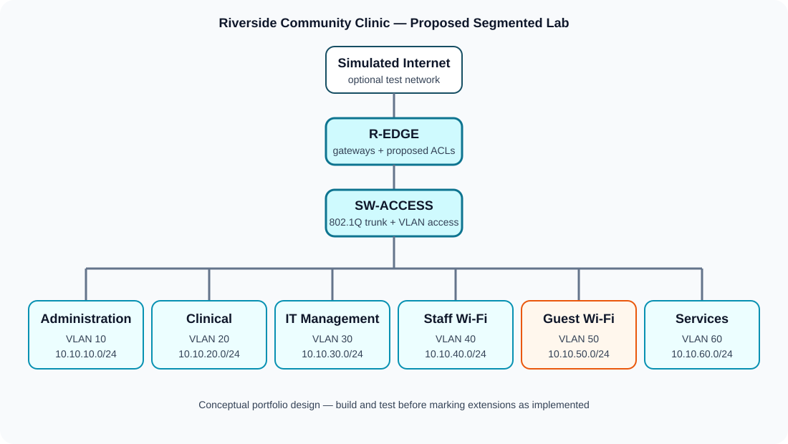

# Healthcare Clinic Network & Security Lab

A reproducible networking portfolio project that translates practical coursework into a fictional small-clinic scenario. It demonstrates foundational network design, IPv4 configuration, wired and wireless connectivity, troubleshooting, and packet analysis without publishing assessment material or real network identifiers.

> **Evidence status:** The foundational skills below were practised in COIT11238 coursework. The clinic design, segmented addressing plan, ACLs, secure Wi-Fi, VPN, monitoring, and other hardening items are **portfolio extensions proposed for a new lab**. They are not claimed as completed until Amir rebuilds and verifies them using the guides in this repository.

## Skills represented truthfully

| Status | Skills |
|---|---|
| Practised in coursework | Cisco Packet Tracer topology design; IPv4 addressing; wired/wireless LANs; `ping`, `tracert`, `ipconfig`, and ARP inspection; DNS/DHCP concepts; Wireshark ICMP inspection; Ethernet and TCP/IP fundamentals; VPN, firewall, authentication, and encryption concepts |
| Proposed portfolio extensions | VLAN segmentation; router-on-a-stick; inter-VLAN ACLs; dedicated guest Wi-Fi; hardened device administration; central logging/SIEM; MFA; site-to-site VPN implementation |
| Deliberately not included | Fabricated `.pkt` files, fabricated `.pcap/.pcapng` captures, copied assessment questions, real credentials, real MAC addresses, or private institutional network details |

## Scenario

The fictional **Riverside Community Clinic** needs separate network zones for administration, clinical devices, IT management, staff Wi-Fi, guest Wi-Fi, and shared services. The target design applies least privilege: guests receive internet-only access, administration cannot manage infrastructure, and the IT zone is the only user segment permitted to reach device-management interfaces.



## Repository map

```text
healthcare-network-security-lab/
├── README.md
├── docs/
│   ├── architecture.md
│   ├── addressing-plan.md
│   ├── implementation-status.md
│   ├── security-design.md
│   └── troubleshooting-runbook.md
├── packet-tracer/
│   └── BUILD-GUIDE.md
├── wireshark/
│   ├── CAPTURE-GUIDE.md
│   └── ANALYSIS-TEMPLATE.md
├── configs/
│   ├── README.md
│   ├── router-example.txt
│   └── switch-example.txt
├── diagrams/
│   ├── logical-topology.svg
│   └── traffic-policy.svg
└── screenshots/
    └── README.md
```

## Reproduce the lab

1. Read the [architecture](docs/architecture.md) and [addressing plan](docs/addressing-plan.md).
2. Follow the [Packet Tracer build guide](packet-tracer/BUILD-GUIDE.md), recording each verification result.
3. Use the configuration files as **examples to adapt**, not as evidence of execution.
4. Follow the [Wireshark capture guide](wireshark/CAPTURE-GUIDE.md) on an authorised lab network.
5. Add only genuine, sanitised evidence following the [screenshot checklist](screenshots/README.md).
6. Update [implementation status](docs/implementation-status.md) after each test passes.

## Expected verification

- Hosts receive or use an address from the correct subnet.
- Same-VLAN endpoints communicate.
- Permitted inter-VLAN traffic succeeds.
- Guest-to-internal traffic is denied while guest-to-internet simulation remains permitted.
- DNS resolution and DHCP behaviour can be explained and tested.
- ICMP Echo Request/Reply traffic can be captured and interpreted.
- Failed tests are recorded using the [troubleshooting runbook](docs/troubleshooting-runbook.md).

## Recruiter summary

This repository shows how Amir approaches an entry-level network task: translate requirements into a topology and addressing plan, build reproducibly, test methodically, inspect packet behaviour, document faults, and propose proportionate security improvements. The lab is relevant to IT support, network support, SOC/cybersecurity internship, and healthcare IT roles.

## Privacy and ethics

All organisation names, addresses, hostnames, and IP addresses are fictional or reserved for documentation/lab use. Do not add patient data, university-only material, real credentials, public IPs, MAC addresses, or captures from networks you do not own or have permission to inspect.

## Licence

Documentation and original diagrams are released under the [MIT License](LICENSE). Cisco Packet Tracer and Wireshark remain subject to their respective owners' terms.
