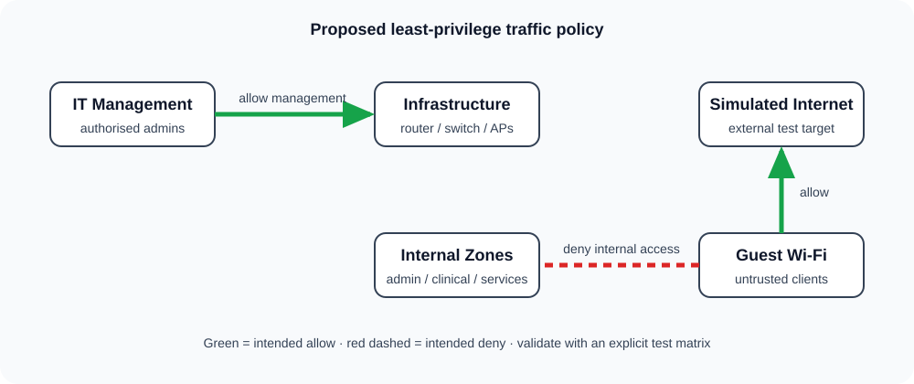

# Security design

These controls are **design proposals** until verified in the implementation ledger.

## Traffic policy

| Source | Destination | Intended policy | Reason |
|---|---|---|---|
| IT | Network management | Allow | Authorised administration |
| Administration | Shared DNS/DHCP | Allow required services | Basic operations |
| Clinical | Shared DNS/DHCP | Allow required services | Basic operations |
| Staff Wi-Fi | Shared DNS/DHCP | Allow required services | Basic operations |
| Guest | Internal RFC 1918 ranges | Deny | Guest isolation |
| Guest | Simulated internet | Allow | Visitor access |
| Non-IT user zones | Network management | Deny | Least privilege |
| Any | Any | Deny unless required | Reduce unintended paths |

## Layered improvements

- **Segmentation:** VLANs reduce unnecessary broadcast and trust scope.
- **Access control:** Apply inbound ACLs close to source zones; document every exception.
- **Wireless:** Separate staff and guest SSIDs. In real equipment, prefer WPA3-Enterprise/802.1X for staff and client isolation for guests.
- **Administration:** Use SSH rather than Telnet, named administrator accounts, protected secrets, timeout settings, and an IT-only management path.
- **Visibility:** Centralise time, syslog, asset inventory, and configuration backups before claiming monitoring capability.
- **Resilience:** Back up configuration and test restoration. Production healthcare environments also need high availability and formal downtime procedures.

## Future extensions

MFA, SIEM alerting, network access control, vulnerability management, and a site-to-site VPN are useful next stages. They are intentionally not simulated or claimed here.
