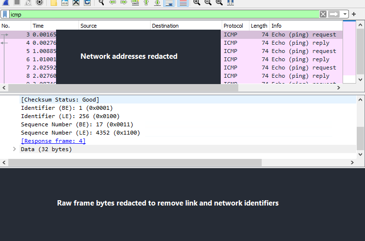

# Wireshark capture guide

Create a real capture only on a device and network you own or are authorised to inspect. The repository contains no fabricated packet capture.

## Genuine prior-work example

This screenshot was extracted from my coursework and shows genuine ICMP Echo Request/Reply inspection. Network addresses and raw frame bytes were covered with opaque redaction before publication because they can expose link- and network-layer identifiers. The visible filter, ICMP packet types, checksum result, identifier, sequence number, and response-frame reference remain genuine. This image is evidence of prior packet-analysis practice, not a capture from the fictional clinic lab.

## Safe lab procedure

1. Close unrelated applications to minimise incidental data.
2. Select the lab interface by observing its traffic graph; do not capture on a university or workplace interface.
3. Start capture, then generate a small controlled test such as `ping 10.10.10.1`.
4. Stop capture immediately after several request/reply pairs.
5. Use the display filter `icmp` (IPv4) or `icmpv6` (IPv6).
6. Select one Echo Request and its matching Echo Reply. Compare type, code, identifier, sequence number, source/destination, TTL, and frame length.
7. If demonstrating ARP, clear only your authorised lab host's cache if appropriate, then use `arp` as the display filter and generate local traffic.
8. Save the original capture outside the public repository. Export a minimal sanitised capture only if every frame has been reviewed.

## Privacy review before publication

- Remove unrelated packets and payloads.
- Ensure addresses and hostnames belong only to the fictional lab.
- Do not publish real public IPs, MAC addresses, usernames, cookies, tokens, DNS history, or patient/personal data.
- Prefer screenshots with MAC addresses removed, cropped, or covered with opaque redaction.
- State the tool/version and test method; never imply the capture came from production healthcare equipment.

Use [ANALYSIS-TEMPLATE.md](ANALYSIS-TEMPLATE.md) to document findings without inventing values.
